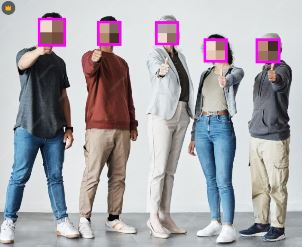

# ImageRedact

On-device image redaction SDK for Android. ImageRedact takes an image and returns a masked image, so only the redacted result is uploaded or stored remotely.


---

## Why ImageRedact
- **Zero raw exposure**: mask on-device before any upload.
- **Simple API**: pass a Bitmap/File/Uri, get a masked result.
- **Privacy-first defaults**: text is solid masked, faces are pixelated.
- **Camera-agnostic**: no CameraX required for integration.

---

## Before / After




---

## Features
- Face detection (ML Kit)
- Text detection (ML Kit Text Recognition V2)
- Solid masking for text (no blur)
- Pixelation (mosaic) for faces
- Debug outline option for visual verification
- Sample app that loads an image and shows the masked result

---

## Dependencies
- Google ML Kit Face Detection (`com.google.mlkit:face-detection`)
- Google ML Kit Text Recognition V2 (`com.google.android.gms:play-services-mlkit-text-recognition`)
- AndroidX ExifInterface (`androidx.exifinterface:exifinterface`)

ML Kit models may download via Play Services on first use.

## Modules
- `:ImageRedact-core` - SDK logic (masking, detection, utilities)
- `:ImageRedact-samples` - sample app using the SDK

---

## Install (JitPack)

Add JitPack repository:

```kotlin
dependencyResolutionManagement {
    repositories {
        google()
        mavenCentral()
        maven { url = uri("https://jitpack.io") }
    }
}
```

Add dependency:

Groovy:
```groovy
dependencies {
    implementation 'com.github.jtl4098:ImageRedact:v0.2.0'
}
```

Kotlin:
```kotlin
dependencies {
    implementation("com.github.jtl4098:ImageRedact:v0.2.0")
}
```

---

## Quick Start

### Callback API
```kotlin
val ImageRedact = ImageRedact(context)

ImageRedact.maskFile(file,
    onSuccess = { result ->
        val masked = result.bitmap
        val faces = result.faceCount
        val texts = result.textCount
    },
    onError = { error ->
        // handle error
    }
)
```

### Suspend API
```kotlin
val ImageRedact = ImageRedact(context)
val result = ImageRedact.maskFile(file)
```

---

## API Overview

```kotlin
class ImageRedact(context: Context, options: MaskOptions = MaskOptions()) {
    fun maskBitmap(bitmap: Bitmap, rotationDegrees: Int = 0, onSuccess: (MaskResult) -> Unit, onError: (Throwable) -> Unit)
    fun maskFile(file: File, onSuccess: (MaskResult) -> Unit, onError: (Throwable) -> Unit)
    fun maskUri(uri: Uri, onSuccess: (MaskResult) -> Unit, onError: (Throwable) -> Unit)

    suspend fun maskBitmap(bitmap: Bitmap, rotationDegrees: Int = 0): MaskResult
    suspend fun maskFile(file: File): MaskResult
    suspend fun maskUri(uri: Uri): MaskResult
}
```

**MaskOptions**
- `detectFaces`: enable face detection
- `detectText`: enable text detection
- `textMaskColor`: solid color for text masks
- `facePixelSize`: pixel size for face mosaic
- `debugOutline`: show debug bounding boxes

**MaskResult**
- `bitmap`: masked output
- `faceCount`: number of faces detected
- `textCount`: number of text blocks detected
- `regions`: list of detected regions

---

## Recommended Usage
- Always upload or store **only** the masked output.
- Avoid saving the original photo after masking.
- Consider stripping EXIF metadata before upload (planned in roadmap).

---

## Performance Tips
- Use a worker executor for background processing.
- For large images, consider downsampling before detection.
- Use device-side caching only if you handle it securely.

---

## Roadmap
- EXIF stripping utility
- Region-based masking for large images
- Optional camera helper module (separate from core)
- More flexible mask styles

---

## Sample App
The sample app (`:ImageRedact-samples`) lets you load an image and preview the masked output. It does not use CameraX and is safe for emulator testing.

---

## Contributing
- Issues and PRs are welcome.
- Keep core SDK camera-agnostic.
- Avoid storing or transmitting raw images.

---

## License
Apache 2.0. See `LICENSE`.


